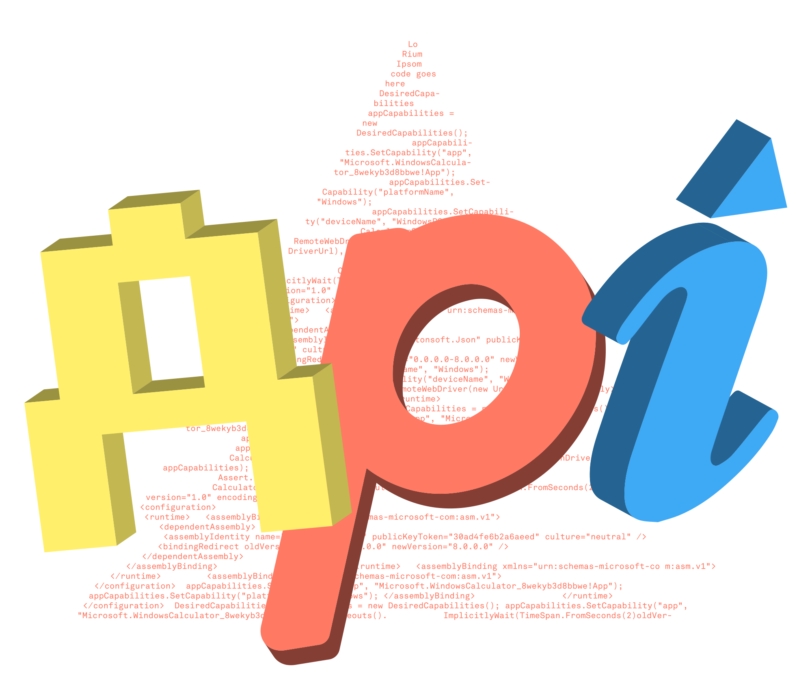

# ⚡️ Up API

Let’s **hack** on _banking_ together!

Calling all makers, creators, hackers, and hobbyists.
Welcome to the first stage of [Up’s](https://up.com.au) API: a beta release
that gives you programmatic access to your balances and transaction data. You
can request past transactions or set up webhooks to receive real time events
when new transactions hit your account. It’s new, exciting and just the
beginning.

  

## Links

* 🕶 [The Up Website](https://up.com.au)
* 📖 [API Documentation](https://developer.up.com.au)
* 🕵️ [API Issues and Support](https://github.com/up-banking/api/issues)
* 🚀 [API Changelog](https://github.com/up-banking/api/issues/31)

Please ensure you keep any personal information out of issues submitted on this
repository.

## Getting Started

The Up API is currently in beta 🔧. Many features you would expect are notably
absent but will be added over time. In this early phase access is limited to
personal use only.

If you don’t already have an Up bank account, you can head over to
https://up.com.au to download the app and create a free account.
[Terms and conditions](https://up.com.au/terms) apply.

Once you have an Up account, you can get your Personal Access Token at
https://api.up.com.au.

Head on over and read the API documentation at https://developer.up.com.au once
you have your access token ❤️.

## The OpenAPI Specification

This repository contains the
[OpenAPI Specification](https://swagger.io/specification/) for the Up API.
Issues and feature requests relating to the Up API should be filed against this
repository.

While the OpenAPI document is itself a valid OpenAPI schema, it includes some
additional vendor-specific extensions to support automatic generation of
documentation that would otherwise be difficult or impossible to achieve with
OpenAPI alone. These vendor-specific extensions are prefixed with `x-up:`.
Tools designed to support OpenAPI specification files should ignore these
fields. Currently we only include `x-up:example` but we anticipate adding new
`x-up:` prefixed fields over time as our documentation capability evolves.

